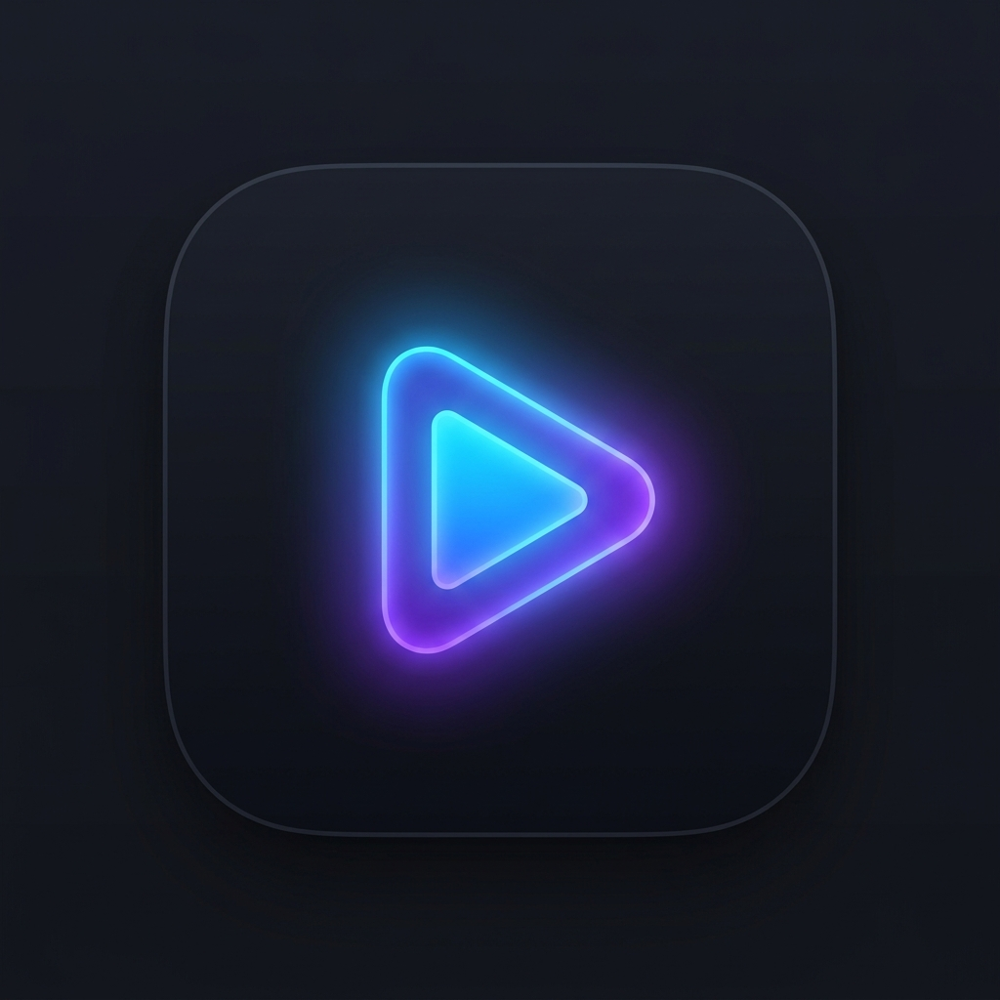

<div align="center">



# Aura Player

**Sua mídia. Do seu jeito.**

Player de vídeo e Live HLS para Windows, com navegação e recepção DLNA/UPnP — sem nuvem, sem conta, sem mensalidade.

[](https://github.com/ryan1235/player/actions/workflows/release.yml)
[](https://github.com/ryan1235/player/releases/latest)
[](https://github.com/ryan1235/player/releases)

[](https://github.com/ryan1235/player/issues)
[](https://github.com/ryan1235/player/stargazers)
[](LICENSE)

<p>
  <a href="#download"><b>Download</b></a> ·
  <a href="#recursos">Recursos</a> ·
  <a href="#rodando-localmente">Rodando localmente</a> ·
  <a href="#estrutura-do-projeto">Estrutura</a> ·
  <a href="#suporte">Suporte</a>
</p>

</div>

<br />

<div align="center">

| | | | |
|:---:|:---:|:---:|:---:|
| **Grátis pra sempre** | **Sem anúncios** | **Sem telemetria** | **Código aberto** |

</div>

---

## O que é

Aura Player reproduz seus arquivos locais e transmite pra qualquer TV, NAS ou celular da sua rede via DLNA/UPnP — e faz isso sem depender de nenhum serviço externo. Tudo roda localmente: reprodução de arquivo, navegação por servidores da rede, recepção de cast do celular e transmissões ao vivo (Live HLS), com um motor de buffer adaptativo construído do zero pra lidar com rede real, não uma rede ideal de laboratório.

## Recursos

### Reprodução
- Arquivos locais: MP4, MKV, AVI, MOV, WebM, FLV, M4V, TS.
- Vídeo embutido na própria janela do app (mpv rodando como janela nativa filha, sincronizada em tempo real com o layout).
- Interface flutuante minimalista via [uosc](https://github.com/tomasklaen/uosc), com a cor de destaque combinando com o app.
- Retoma automaticamente de onde parou (posição salva a cada ~8s, sobrevive a queda de energia/crash).
- Áudio e legenda em português selecionados automaticamente quando disponíveis (`pt-br > pt > por > eng`).

### DLNA / UPnP
- Descoberta de servidores DLNA da rede (NAS, Plex, Jellyfin, compartilhamentos Windows) via SSDP, com navegação de pastas embutida.
- **Modo "Receber"**: o PC aparece na rede como alvo de "Transmitir para dispositivo" — apps como BubbleUPnP, VLC mobile ou o próprio recurso nativo do Windows conseguem mandar vídeo pra ele.

### Ao vivo (Live HLS)
Motor de live reformulado para se adaptar a rede real, não travar em loop e recuperar rápido quando a conexão cai:
- Throughput real medido continuamente (médias móveis + estabilidade), não só a velocidade "nominal" da internet.
- Buffer-alvo adaptativo: menor latência possível enquanto a rede aguenta, mais margem automaticamente quando ela piora.
- Sistema de confiança por histórico — depois de alguns minutos sem travar, testa reduzir a latência gradualmente; qualquer travamento novo reverte isso na hora.
- Detecção de degradação *antes* do buffer zerar, watchdog de "falso funcionamento" (processo vivo mas travado) e watchdog de processo do mpv realmente travado.
- Reconexão com backoff exponencial (sem martelar a mesma tentativa fadada a falhar, sem desistir rápido demais de uma queda passageira).
- Perfis de buffer (Automático / Baixa latência / Balanceado / Estável / Personalizado) em Configurações → Ao Vivo, com notificações discretas de quando o sistema está ajustando velocidade, recuperando ou pulando pra borda ao vivo.
- Overlay de debug (`Ctrl+Shift+D`) com throughput, saúde da conexão, buffer, latência e estado interno em tempo real.

### Interface
- Tema claro e escuro.
- Biblioteca com miniaturas geradas automaticamente.
- Histórico de reprodução.
- Configurações organizadas por categoria (Geral, Aparência, Reprodução, Player, Ao Vivo, DLNA, Avançado, Sobre).

## Por que o Aura Player

| | Player comum | **Aura Player** | Streaming pago |
|---|:---:|:---:|:---:|
| Reproduz seus próprios arquivos | ✓ | ✓ | ✗ |
| Transmite pra TV via DLNA | – | ✓ | ✗ |
| Sem mensalidade | ✓ | ✓ | ✗ |
| Funciona sem internet | ✓ | ✓ | ✗ |
| Código aberto | – | ✓ | ✗ |
| Retoma de onde parou automaticamente | ✗ | ✓ | ✓ |

`✓` sim · `✗` não · `–` parcial

## Download

A forma mais simples é baixar o instalador pronto — nenhuma dependência externa, o mpv já vem embutido:

<div align="center">

**[⬇ Baixar a versão mais recente](https://github.com/ryan1235/player/releases/latest)** &nbsp;·&nbsp; Windows 10/11 (64-bit) &nbsp;·&nbsp; ~153 MB

</div>

Requisitos: Windows 10/11 (64-bit). O instalador ainda não tem assinatura de código — o Windows SmartScreen pode avisar na primeira execução; isso é esperado em projetos independentes recém-lançados, não é detecção de vírus (explicação completa na página de Download do site oficial, ver abaixo — ainda não publicada). Está em andamento uma aplicação pra assinatura gratuita via [SignPath Foundation](https://signpath.org/) (programa pra projetos open source).

Pra conferir a integridade do instalador baixado, compare o hash SHA-512 dele com o publicado em `latest.yml` de cada [release](https://github.com/ryan1235/player/releases) (arquivo gerado automaticamente pelo electron-builder).

Teve algum problema? A página de Suporte do site oficial cobre os erros mais comuns (instalação, reprodução, live, DLNA) — enquanto o site não é publicado, [abra uma issue](https://github.com/ryan1235/player/issues).

## Rodando localmente

Pré-requisito pra rodar em modo desenvolvimento: um `mpv.exe` em `bin/` (não versionado no git — copie um build estático, ex. [shinchiro/mpv-winbuild](https://sourceforge.net/projects/mpv-player-windows/files/), ou instale via `winget install mpv.mpv` e copie o executável pra `bin/mpv.exe`). O app **só** usa esse caminho — sem fallback pro mpv do sistema (ver `resolveMpvBinary()` em `src/mpv.js`).

```bash
npm install
npm start
```

### Gerando o instalador

```bash
npm run dist
```

Gera `dist/Aura Player Setup <versão>.exe` (NSIS), com o `mpv.exe` de `bin/` empacotado junto. Builds oficiais são gerados automaticamente pelo [workflow de release](.github/workflows/release.yml) a cada tag `v*.*.*`.

#### Checklist de cada release (enquanto o instalador não é assinado)

Sem assinatura de código, cada `.exe` publicado começa do zero em reputação — o Windows SmartScreen e antivírus tratam cada hash novo como desconhecido. Até a aplicação no SignPath Foundation ser aprovada, fazer isso a cada release ajuda a reduzir falso-positivo e dá pro usuário conferir por conta própria:

1. Depois de `npm run dist`, escanear `dist/AuraPlayerSetup.exe` no [VirusTotal](https://www.virustotal.com/) e colar o link do resultado nas notas da release do GitHub.
2. Submeter o mesmo `.exe` em [Microsoft Security Intelligence](https://www.microsoft.com/en-us/wdsi/filesubmission) pra revisão manual (gratuito, reduz falso-positivo do Defender — não acelera o SmartScreen, que é reputação por download orgânico).
3. Nunca substituir a falta de assinatura por um certificado autoassinado "de fachada" — o SmartScreen tende a tratar isso como sinal de evasão de malware, piorando a reputação em vez de ajudar.

### Site oficial

A landing page (React + Three.js, com páginas de download e suporte) fica isolada em [`site/`](site/), com seu próprio `package.json`:

```bash
cd site
npm install
npm run dev
```

Veja [`site/README.md`](site/README.md) para mais detalhes.

## Estrutura do projeto

```
src/
  main.js                processo principal do Electron, IPC handlers
  preload.js             ponte segura entre renderer e main
  mpv.js                 controla o mpv externo via IPC (named pipe), orquestra o Live Engine
  live/                  motor de live: NetworkMonitor, BufferManager, StreamHealth,
                         LatencyManager, RecoveryManager, ReconnectManager
  segments/              identificação/fingerprint de segmentos de mídia
  services/logger.js     logger estruturado (alimenta Configurações → Avançado → Logs)
  dlna.js                descoberta SSDP + browse SOAP no ContentDirectory
  dlna-renderer.js       modo "Receber" (DLNA MediaRenderer / cast target)
  library.js             biblioteca local + geração de miniaturas
  watch-history.js       persistência de posição de reprodução
  settings.js            persistência de configurações
  auto-updater.js         auto-update real via electron-updater (baixa e instala sozinho, GitHub Releases)
  i18n.js                strings da interface (PT-BR / EN)
  index.html, renderer.js, styles.css        janela principal (UI)
  overlay.html, overlay-renderer.js, overlay.css   overlay transparente de controles sobre o vídeo
mpv-config/              config-dir dedicado do mpv (uosc + script-opts)
site/                    landing page oficial (projeto isolado, ver site/README.md)
.github/workflows/       build e release automáticos do instalador
```

## Limitações conhecidas

- Suporte apenas a Windows — o embed de vídeo usa APIs nativas do Windows (`--wid` + `SetWindowPos`) pra colocar o mpv dentro da janela do Electron.
- Sem espelhamento de tela tipo AirPlay (protocolo diferente do DLNA, exigiria um binário externo tipo UxPlay).
- Eventing UPnP (GENA/SUBSCRIBE) responde 200 mas não envia notificações de mudança de estado — comandos (play/pause/seek/volume) funcionam normalmente, só o status pode demorar um pouco a mais pra atualizar em apps que dependem disso.
- O Firewall do Windows costuma pedir permissão na primeira vez que o modo "Receber" é ativado — precisa permitir em redes privadas.

## Suporte

- Página de Suporte do site oficial — erros mais comuns, organizados por categoria (link aqui assim que o site for publicado).
- [Abrir uma issue](https://github.com/ryan1235/player/issues) — pra bugs não cobertos acima.

## Contribuindo

O projeto é código aberto e contribuições são bem-vindas. Abra uma issue antes de mudanças grandes pra alinhar a abordagem; para correções pequenas, pull requests diretos são bem-vindos.

## Licença

[GPL-3.0-or-later](LICENSE). Qualquer redistribuição (inclusive forks) precisa manter o código aberto sob a mesma licença — compatível com o [mpv](https://mpv.io/) (também GPL), que vem embutido no instalador.

## Créditos

Reprodução de vídeo via [mpv](https://mpv.io/), interface flutuante via [uosc](https://github.com/tomasklaen/uosc). Desenvolvido por Ryan Luca e a equipe da [Archipixel](https://archipixel.com.br/).
